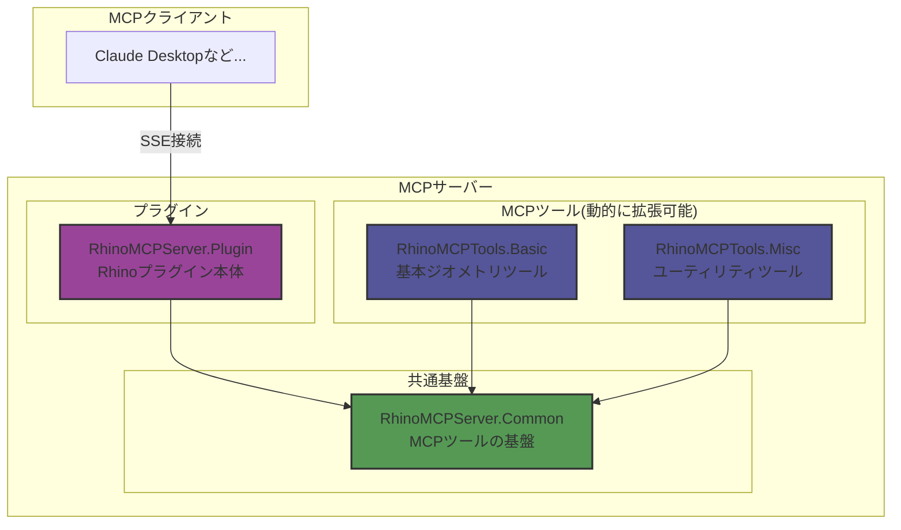

# RhinoMCPServer

RhinocerosでModel Context Protocol (MCP)サーバーを実行するためのプラグインです。Rhinoの機能をMCPツールとして提供し、MCPクライアントと効率的な通信を実現します。

## 概要

このプラグインは、公式の[Model Context Protocol C# SDK](https://github.com/modelcontextprotocol/csharp-sdk)を使用してRhinoの機能をMCPクライアントに公開します。WebSocket通信ではなく、Server-Sent Events (SSE)を採用することで、より効率的で軽量な双方向通信を実現しています。

## プロジェクト構成

プロジェクトは以下のライブラリで構成されています：

- `RhinoMCPServer.Common`: MCPツールの共通基盤（インターフェース、ツール管理など）
- `RhinoMCPServer.Plugin`: Rhinoプラグインの本体
- `RhinoMCPTools.Basic`: 基本的なジオメトリ操作ツール群
- `RhinoMCPTools.Misc`: ユーティリティツール群

## プラグイン拡張性

MCPツールはdllから動的にロードされる仕組みを採用しており：

- 新規ツールをdllとして追加するだけで機能拡張が可能
- プラグインの追加・削除が容易
- サーバー再起動で新しいツールを自動認識

## 使用例
### スケッチから作図 & 属性情報の付与
https://github.com/user-attachments/assets/5eaae01c-27b7-4d4f-961f-a4c1ad64ff7f

## システム要件

- Rhino 9 WIP
- .NET 8.0 Runtime

## 使用方法

### MCPサーバーの起動

1. Rhinoのコマンドラインに`StartMCPServer`と入力します
2. ポート番号の設定
   - デフォルト：3001（Enterキーを押すと自動的に使用）
   - カスタム：任意のポート番号を入力可能
3. サーバー起動後、指定したポートでMCPクライアントからの接続を待機します

### MCPクライアントとの接続

現在、Claude DesktopのMCPクライアントはSSE接続に直接対応していないため、[標準入出力をSSEにブリッジするmcpサーバー](https://github.com/boilingdata/mcp-server-and-gw)を使用する必要があります。

## 提供されるMCPツール

- **echo**
  - 機能：入力テキストのエコーバック（ヘルスチェック用）
  - パラメータ：
    - `message` (string, required) - エコーバックするテキスト

- **sphere**
  - 機能：Rhino内での球体作成
  - パラメータ：
    - `radius` (number, required) - 球体の半径（単位：Rhinoの現在の単位系）
    - `x` (number, optional, default: 0) - 球体の中心のX座標
    - `y` (number, optional, default: 0) - 球体の中心のY座標
    - `z` (number, optional, default: 0) - 球体の中心のZ座標

- **deleteObject**
  - 機能：指定されたGUIDのRhinoオブジェクトを削除
  - パラメータ：
    - `guid` (string, required) - 削除するオブジェクトのGUID
- **polyline**
  - 機能：指定された点列から折れ線を作成
  - パラメータ：
    - `points` (array, required, minItems: 2) - 折れ線の頂点を定義する点の配列
      - 各点のパラメータ：
        - `x` (number, required) - X座標
        - `y` (number, required) - Y座標
        - `z` (number, optional, default: 0) - Z座標

- **set_user_text**
  - 機能：Rhinoオブジェクトにユーザーテキスト属性を設定
  - パラメータ：
    - `guid` (string, required) - 対象のRhinoオブジェクトのGUID
    - `key` (string, required) - ユーザーテキスト属性のキー
    - `value` (string, required) - 設定する値

## ログ

サーバーのログは以下の場所に保存されます：
- プラグインディレクトリ内の`logs/MCPRhinoServer_.log`

## ライセンス

本プロジェクトは[MITライセンス](./LICENSE)のもとで公開されています。詳細はLICENSEファイルをご確認ください。
