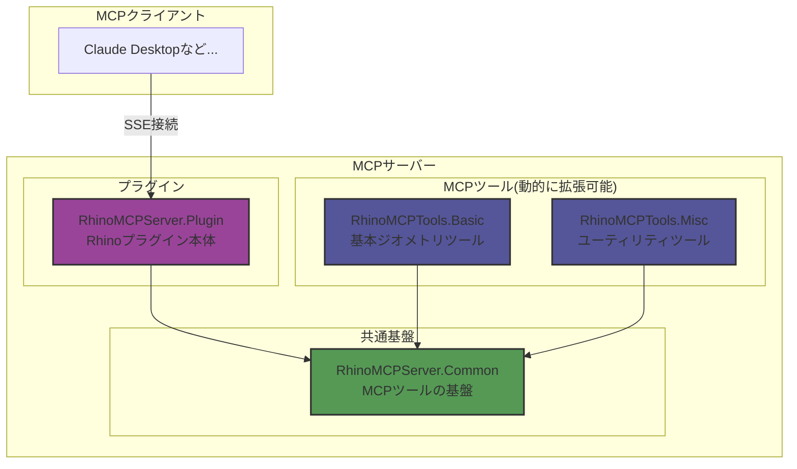

# RhinoMCPServer

RhinocerosでModel Context Protocol (MCP)サーバーを実行するためのプラグインです。Rhinoの機能をMCPツールとして提供し、MCPクライアントと効率的な通信を実現します。

## 概要

このプラグインは、公式の[Model Context Protocol C# SDK](https://github.com/modelcontextprotocol/csharp-sdk)を使用してRhinoの機能をMCPクライアントに公開します。WebSocket通信ではなく、Server-Sent Events (SSE)を採用することで、より効率的で軽量な双方向通信を実現しています。

## プロジェクト構成

プロジェクトは以下のライブラリで構成されています：

- `RhinoMCPServer.Common`: MCPツールの共通基盤（インターフェース、ツール管理など）
- `RhinoMCPServer.Plugin`: Rhinoプラグインの本体
- `RhinoMCPTools.Basic`: 基本的なジオメトリ操作ツール群
- `RhinoMCPTools.Misc`: ユーティリティツール群

## プラグイン拡張性

MCPツールはdllから動的にロードされる仕組みを採用しており：

- 新規ツールをdllとして追加するだけで機能拡張が可能
- プラグインの追加・削除が容易
- サーバー再起動で新しいツールを自動認識

## 使用例
### スケッチから作図 & 属性情報の付与
https://github.com/user-attachments/assets/5eaae01c-27b7-4d4f-961f-a4c1ad64ff7f

### 既存の図面をトレースさせる
https://github.com/user-attachments/assets/932d62ed-335f-4238-806a-faafcfacf0b6

## システム要件

- Rhino 9 WIP
- .NET 8.0 Runtime

## 使用方法

### MCPサーバーの起動

1. Rhinoのコマンドラインに`StartMCPServer`と入力します
2. ポート番号の設定
   - デフォルト：3001（Enterキーを押すと自動的に使用）
   - カスタム：任意のポート番号を入力可能
3. サーバー起動後、指定したポートでMCPクライアントからの接続を待機します

### MCPクライアントとの接続

現在、Claude DesktopのMCPクライアントはSSE接続に直接対応していないため、[標準入出力をSSEにブリッジするmcpサーバー](https://github.com/boilingdata/mcp-server-and-gw)を使用する必要があります。

## 提供されるMCPツール

### RhinoMCPTools.Basic
基本的なジオメトリ操作や製図機能を提供するツール群です。

#### 製図関連ツール (Drafting)

- **linear_dimension**
  - 機能：2点間の寸法線を作成
  - パラメータ：
    - `start` (object, required) - 始点の座標
      - `x` (number, required) - X座標
      - `y` (number, required) - Y座標
      - `z` (number, optional, default: 0) - Z座標
    - `end` (object, required) - 終点の座標
      - `x` (number, required) - X座標
      - `y` (number, required) - Y座標
      - `z` (number, optional, default: 0) - Z座標
    - `offset` (number, optional, default: 1.0) - 寸法線のオフセット距離
    - `scale` (number, optional, default: 1.0) - 寸法のスケール値（0より大きい値）

- **set_dimension_scale**
  - 機能：寸法オブジェクトのスケールを設定
  - パラメータ：
    - `guids` (array of string, required) - 対象の寸法オブジェクトのGUID配列
    - `scale` (number, required) - 新しい寸法スケール値（0より大きい値）

#### ジオメトリ操作 (Geometry)

- **sphere**
  - 機能：Rhino内での球体作成
  - パラメータ：
    - `radius` (number, required) - 球体の半径（単位：Rhinoの現在の単位系）
    - `x` (number, optional, default: 0) - 球体の中心のX座標
    - `y` (number, optional, default: 0) - 球体の中心のY座標
    - `z` (number, optional, default: 0) - 球体の中心のZ座標

- **rectangle**
  - 機能：中心点、幅（X方向）、高さ（Y方向）から長方形を作成
  - パラメータ：
    - `center` (object, required) - 長方形の中心点
      - `x` (number, required) - X座標
      - `y` (number, required) - Y座標
      - `z` (number, optional, default: 0) - Z座標
    - `width` (number, required) - 長方形の幅（X方向、0より大きい値）
    - `height` (number, required) - 長方形の高さ（Y方向、0より大きい値）

- **polyline**
  - 機能：指定された点列から折れ線を作成
  - パラメータ：
    - `points` (array, required) - 折れ線の頂点を定義する点の配列（最低2点必要）
      - 各点のパラメータ：
        - `x` (number, required) - X座標
        - `y` (number, required) - Y座標
        - `z` (number, optional, default: 0) - Z座標

- **move_objects**
  - 機能：指定されたRhinoオブジェクトをベクトルに沿って移動
  - パラメータ：
    - `guids` (array of string, required) - 移動するオブジェクトのGUID配列
    - `vector` (object, required) - 移動ベクトル
      - `x` (number, required) - X方向の移動距離
      - `y` (number, required) - Y方向の移動距離
      - `z` (number, optional, default: 0) - Z方向の移動距離

#### レイヤー操作 (Layer)

- **create_layer**
  - 機能：新しいレイヤーを作成
  - パラメータ：
    - `name` (string, required) - 作成するレイヤーの名前
    - `color` (string, optional) - レイヤーの色（16進数形式、例：'#FF0000'）
    - `visible` (boolean, optional, default: true) - レイヤーの表示/非表示
    - `locked` (boolean, optional, default: false) - レイヤーのロック状態
    - `parent_name` (string, optional) - 親レイヤーの名前

- **change_object_layer_by_name**
  - 機能：レイヤー名を指定してオブジェクトのレイヤーを変更
  - パラメータ：
    - `guid` (string, required) - 対象のRhinoオブジェクトのGUID
    - `layer_name` (string, required) - 移動先のレイヤー名

- **change_object_layer_by_index**
  - 機能：レイヤーインデックスを指定してオブジェクトのレイヤーを変更
  - パラメータ：
    - `guid` (string, required) - 対象のRhinoオブジェクトのGUID
    - `layer_index` (number, required) - 移動先のレイヤーインデックス

#### オブジェクト操作 (Object)

- **delete_object**
  - 機能：指定されたGUIDのRhinoオブジェクトを削除
  - パラメータ：
    - `guid` (string, required) - 削除するオブジェクトのGUID

- **delete_objects**
  - 機能：複数のRhinoオブジェクトを一括で削除
  - パラメータ：
    - `guids` (array of string, required) - 削除するオブジェクトのGUID配列

- **set_text_dot_size**
  - 機能：テキストドットのフォントサイズを設定
  - パラメータ：
    - `guids` (array of string, required) - 対象のテキストドットのGUID配列
    - `font_height` (number, required) - 新しいフォントサイズ（最小値: 1）

- **set_user_text**
  - 機能：Rhinoオブジェクトにユーザーテキスト属性を設定
  - パラメータ：
    - `guid` (string, required) - 対象のRhinoオブジェクトのGUID
    - `key` (string, required) - ユーザーテキスト属性のキー
    - `value` (string, required) - 設定する値

#### ビュー操作 (View)

- **capture_viewport**
  - 機能：指定されたRhinoビューポートを画像としてキャプチャ
  - パラメータ：
    - `viewportName` (string, optional) - キャプチャするビューポートの名前（未指定の場合はアクティブビューポート）
    - `width` (number, optional) - キャプチャ画像の幅（ピクセル単位、未指定の場合は現在のビューポート幅）
    - `height` (number, optional) - キャプチャ画像の高さ（ピクセル単位、未指定の場合は現在のビューポート高さ）
    - `format` (string, optional, enum: ["png", "jpg"], default: "png") - 出力画像フォーマット
    - `show_object_labels` (boolean, optional, default: true) - オブジェクトにシンプルなシンボルラベル（A, B, C..., AA, AB...）を表示するかどうか
    - `font_height` (number, optional, default: 20.0) - ラベルのフォントサイズ

### RhinoMCPTools.Misc
ユーティリティ機能を提供するツール群です。

- **echo**
  - 機能：入力テキストのエコーバック（ヘルスチェック用）
  - パラメータ：
    - `message` (string, required) - エコーバックするテキスト

## ログ

サーバーのログは以下の場所に保存されます：
- プラグインディレクトリ内の`logs/MCPRhinoServer_.log`

## ライセンス

本プロジェクトは[MITライセンス](./LICENSE)のもとで公開されています。詳細はLICENSEファイルをご確認ください。
