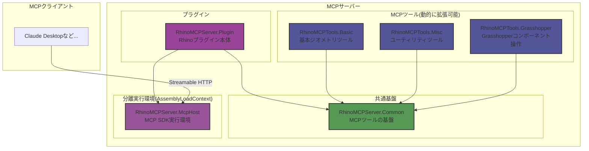

# RhinoMCPServer

RhinocerosでModel Context Protocol (MCP)サーバーを実行するためのプラグインです。Rhinoの機能をMCPツールとして提供し、MCPクライアントと効率的な通信を実現します。

## 概要

このプラグインは、公式の[Model Context Protocol C# SDK](https://github.com/modelcontextprotocol/csharp-sdk)を使用してRhinoの機能をMCPクライアントに公開します。Streamable HTTPプロトコルを採用し、AssemblyLoadContextによる分離実行環境でMCP SDKを動作させることで、Rhinoとの安定した連携を実現しています。

## プロジェクト構成

プロジェクトは以下のライブラリで構成されています：

- `RhinoMCPServer.Common`: MCPツールの共通基盤（インターフェース、ツール管理など）
- `RhinoMCPServer.Plugin`: Rhinoプラグインの本体
- `RhinoMCPServer.McpHost`: MCP SDK分離実行環境（AssemblyLoadContext内で動作）
- `RhinoMCPTools.Basic`: 基本的なジオメトリ操作ツール群
- `RhinoMCPTools.Misc`: ユーティリティツール群
- `RhinoMCPTools.Grasshopper`: Grasshopperコンポーネントの操作・制御を行うツール群

## プラグイン拡張性

MCPツールはdllから動的にロードされる仕組みを採用しており：

- 新規ツールをdllとして追加するだけで機能拡張が可能
- プラグインの追加・削除が容易
- サーバー再起動で新しいツールを自動認識

## 使用例
### スケッチから作図 & 属性情報の付与
https://github.com/user-attachments/assets/5eaae01c-27b7-4d4f-961f-a4c1ad64ff7f

### 既存の図面をトレースさせる
https://github.com/user-attachments/assets/932d62ed-335f-4238-806a-faafcfacf0b6

### レイヤー分けさせる
https://github.com/user-attachments/assets/0a51f35e-3175-4d5f-997a-7dac4c6dad0e

### Grasshopperエージェント
https://github.com/user-attachments/assets/114e1331-c6fe-45f9-b28c-c88799c0643c

## システム要件

- Rhino 9 WIP
- .NET 8.0 Runtime

## 使用方法

### MCPサーバーの起動

1. Rhinoのコマンドラインに`StartMCPServer`と入力します
2. ポート番号の設定
   - デフォルト：3001（Enterキーを押すと自動的に使用）
   - カスタム：任意のポート番号を入力可能
3. サーバー起動後、指定したポートでMCPクライアントからの接続を待機します

### MCPクライアントとの接続

サーバーはStreamable HTTPプロトコルで動作します。Claude DesktopなどのMCPクライアントと接続する場合は、[標準入出力をHTTPにブリッジするmcpサーバー](https://github.com/boilingdata/mcp-server-and-gw)を使用してください。

エンドポイント: `POST http://localhost:{port}/mcp`

## 提供されるMCPツール

### RhinoMCPTools.Basic
基本的なジオメトリ操作や製図機能を提供するツール群です。

#### 製図関連ツール (Drafting)

- **linear_dimension**
  - 機能：2点間の寸法線を作成
  - パラメータ：
    - `start` (object, required) - 始点の座標
      - `x` (number, required) - X座標
      - `y` (number, required) - Y座標
      - `z` (number, optional, default: 0) - Z座標
    - `end` (object, required) - 終点の座標
      - `x` (number, required) - X座標
      - `y` (number, required) - Y座標
      - `z` (number, optional, default: 0) - Z座標
    - `offset` (number, optional, default: 1.0) - 寸法線のオフセット距離
    - `scale` (number, optional, default: 1.0) - 寸法のスケール値（0より大きい値）

- **set_dimension_scale**
  - 機能：寸法オブジェクトのスケールを設定
  - パラメータ：
    - `guids` (array of string, required) - 対象の寸法オブジェクトのGUID配列
    - `scale` (number, required) - 新しい寸法スケール値（0より大きい値）

#### ジオメトリ操作 (Geometry)

- **sphere**
  - 機能：Rhino内での球体作成
  - パラメータ：
    - `radius` (number, required) - 球体の半径（単位：Rhinoの現在の単位系）
    - `x` (number, optional, default: 0) - 球体の中心のX座標
    - `y` (number, optional, default: 0) - 球体の中心のY座標
    - `z` (number, optional, default: 0) - 球体の中心のZ座標

- **circle**
  - 機能：中心点と半径から円を作成
  - パラメータ：
    - `center` (object, required) - 円の中心点
      - `x` (number, required) - X座標
      - `y` (number, required) - Y座標
      - `z` (number, optional, default: 0) - Z座標
    - `radius` (number, required) - 円の半径（0より大きい値）

- **rectangle**
  - 機能：中心点、幅（X方向）、高さ（Y方向）から長方形を作成
  - パラメータ：
    - `center` (object, required) - 長方形の中心点
      - `x` (number, required) - X座標
      - `y` (number, required) - Y座標
      - `z` (number, optional, default: 0) - Z座標
    - `width` (number, required) - 長方形の幅（X方向、0より大きい値）
    - `height` (number, required) - 長方形の高さ（Y方向、0より大きい値）

- **polyline**
  - 機能：指定された点列から折れ線を作成
  - パラメータ：
    - `points` (array, required) - 折れ線の頂点を定義する点の配列（最低2点必要）
      - 各点のパラメータ：
        - `x` (number, required) - X座標
        - `y` (number, required) - Y座標
        - `z` (number, optional, default: 0) - Z座標

- **move_objects**
  - 機能：指定されたRhinoオブジェクトをベクトルに沿って移動
  - パラメータ：
    - `guids` (array of string, required) - 移動するオブジェクトのGUID配列
    - `vector` (object, required) - 移動ベクトル
      - `x` (number, required) - X方向の移動距離
      - `y` (number, required) - Y方向の移動距離
      - `z` (number, optional, default: 0) - Z方向の移動距離

- **get_geometry_info**
  - 機能：Rhinoオブジェクトのジオメトリ情報を取得
  - パラメータ：
    - `guid` (string, required) - 対象のRhinoオブジェクトのGUID
  - 戻り値：オブジェクトの種類に応じた詳細情報
    - Polylineの場合：
      - `points` (array) - 頂点座標の配列
      - `length` (number) - 折れ線の全長
      - `is_closed` (boolean) - 閉じているかどうか
      - `segment_count` (number) - セグメント数
      - `point_count` (number) - 頂点数
    - Circleの場合：
      - `center` (object) - 中心点の座標
      - `radius` (number) - 半径
      - `circumference` (number) - 円周
      - `diameter` (number) - 直径
      - `plane` (object) - 円の平面情報
    - Surfaceの場合：
      - `is_periodic` (boolean) - 周期性の有無
      - `is_singular` (boolean) - 特異点の有無
      - `domain` (object) - パラメータ領域
      - `bounding_box` (object) - バウンディングボックス
    - Brepの場合：
      - `face_count` (number) - フェース数
      - `edge_count` (number) - エッジ数
      - `vertex_count` (number) - 頂点数
      - `is_solid` (boolean) - ソリッドかどうか
      - `is_manifold` (boolean) - マニフォールドかどうか
      - `area` (number) - 表面積
      - `volume` (number) - 体積（ソリッドの場合のみ）

#### レイヤー操作 (Layer)

- **create_layer**
  - 機能：新しいレイヤーを作成
  - パラメータ：
    - `full_path` (string, required) - 作成するレイヤーのフルパス（例：'Parent::Child::Grandchild'）
    - `color` (string, optional) - レイヤーの色（16進数形式、例：'#FF0000'）
    - `visible` (boolean, optional, default: true) - レイヤーの表示/非表示
    - `locked` (boolean, optional, default: false) - レイヤーのロック状態

- **change_object_layer_by_full_path**
  - 機能：レイヤーのフルパスを指定してオブジェクトのレイヤーを変更
  - パラメータ：
    - `guid` (string, required) - 対象のRhinoオブジェクトのGUID
    - `layer_full_path` (string, required) - 移動先のレイヤーのフルパス（例：'Parent::Child::Grandchild'）

- **change_object_layer_by_index**
  - 機能：レイヤーインデックスを指定してオブジェクトのレイヤーを変更
  - パラメータ：
    - `guid` (string, required) - 対象のRhinoオブジェクトのGUID
    - `layer_index` (number, required) - 移動先のレイヤーインデックス

- **list_layers**
  - 機能：ドキュメント内の全レイヤー情報を取得
  - パラメータ：なし
  - 戻り値：レイヤー情報の配列
    - `full_path` (string) - レイヤーのフルパス
    - `index` (number) - レイヤーインデックス
    - `id` (string) - レイヤーのID
    - `color` (string) - レイヤーの色（16進数形式）
    - `visible` (boolean) - レイヤーの表示/非表示状態
    - `locked` (boolean) - レイヤーのロック状態

#### オブジェクト操作 (Object)

- **delete_object**
  - 機能：指定されたGUIDのRhinoオブジェクトを削除
  - パラメータ：
    - `guid` (string, required) - 削除するオブジェクトのGUID

- **delete_objects**
  - 機能：複数のRhinoオブジェクトを一括で削除
  - パラメータ：
    - `guids` (array of string, required) - 削除するオブジェクトのGUID配列

- **set_text_dot_size**
  - 機能：テキストドットのフォントサイズを設定
  - パラメータ：
    - `guids` (array of string, required) - 対象のテキストドットのGUID配列
    - `font_height` (number, required) - 新しいフォントサイズ（最小値: 1）

- **set_user_text**
  - 機能：Rhinoオブジェクトにユーザーテキスト属性を設定
  - パラメータ：
    - `guid` (string, required) - 対象のRhinoオブジェクトのGUID
    - `key` (string, required) - ユーザーテキスト属性のキー
    - `value` (string, required) - 設定する値

- **set_object_name**
  - 機能：Rhinoオブジェクトの名前を設定
  - パラメータ：
    - `guid` (string, required) - 対象のRhinoオブジェクトのGUID
    - `name` (string, required) - 設定する名前

- **get_object_name**
  - 機能：Rhinoオブジェクトの名前を取得
  - パラメータ：
    - `guid` (string, required) - 対象のRhinoオブジェクトのGUID
  - 戻り値：
    - `name` (string) - オブジェクトの名前（設定されていない場合は空文字列）

- **get_object_attributes**
  - 機能：Rhinoオブジェクトの属性情報を取得
  - パラメータ：
    - `guid` (string, required) - 対象のRhinoオブジェクトのGUID
  - 戻り値：オブジェクトの属性情報
    - `name` (string) - オブジェクトの名前
    - `layer_index` (number) - レイヤーのインデックス
    - `layer_name` (string) - レイヤーの名前
    - `object_color` (object) - オブジェクトの色
      - `r` (number) - 赤成分 (0-255)
      - `g` (number) - 緑成分 (0-255)
      - `b` (number) - 青成分 (0-255)
      - `a` (number) - アルファ値 (0-255)
    - `color_source` (string) - 色の設定元
    - `plot_color` (object) - プロット時の色
      - `r` (number) - 赤成分 (0-255)
      - `g` (number) - 緑成分 (0-255)
      - `b` (number) - 青成分 (0-255)
      - `a` (number) - アルファ値 (0-255)
    - `plot_weight` (number) - プロット時の線の太さ
    - `visible` (boolean) - 可視性
    - `mode` (string) - オブジェクトのモード (Normal/Locked/Hidden等)
    - `object_type` (string) - オブジェクトの種類
    - `user_text` (object) - ユーザーテキスト属性（キーと値のペア）

#### ビュー操作 (View)

- **capture_viewport**
  - 機能：指定されたRhinoビューポートを画像としてキャプチャ
  - パラメータ：
    - `viewportName` (string, optional) - キャプチャするビューポートの名前（未指定の場合はアクティブビューポート）
    - `width` (number, optional) - キャプチャ画像の幅（ピクセル単位、未指定の場合は現在のビューポート幅）
    - `height` (number, optional) - キャプチャ画像の高さ（ピクセル単位、未指定の場合は現在のビューポート高さ）
    - `format` (string, optional, enum: ["png", "jpg"], default: "png") - 出力画像フォーマット
    - `show_object_labels` (boolean, optional, default: true) - オブジェクトにシンプルなシンボルラベル（A, B, C..., AA, AB...）を表示するかどうか
    - `font_height` (number, optional, default: 20.0) - ラベルのフォントサイズ

- **raycast_from_screen**
  - 機能：スクリーン座標からレイキャストを実行し、ヒットしたオブジェクトの情報を取得
  - パラメータ：
    - `x` (number, required) - 正規化されたX座標（0.0〜1.0）
    - `y` (number, required) - 正規化されたY座標（0.0〜1.0）
    - `viewportName` (string, optional) - 使用するビューポートの名前（未指定の場合はアクティブビューポート）
  - 戻り値：
    - `hit` (boolean) - オブジェクトにヒットしたかどうか
    - `object_info` (object, ヒット時のみ) - ヒットしたオブジェクトの情報
      - `guid` (string) - オブジェクトのGUID
      - `type` (string) - ジオメトリの種類
      - `hit_point` (object) - ヒット点の座標（x, y, z）
      - `layer` (number) - レイヤーインデックス

### RhinoMCPTools.Misc
ユーティリティ機能を提供するツール群です。

- **echo**
  - 機能：入力テキストのエコーバック（ヘルスチェック用）
  - パラメータ：
    - `message` (string, required) - エコーバックするテキスト

### RhinoMCPTools.Grasshopper
Grasshopper関連の機能を提供するツール群です。

#### コンポーネント管理 (Components)

- **get_canvas_components**
  - 機能：現在のキャンバス上のすべてのコンポーネント情報を取得
  - パラメータ：
    - `include_params` (boolean, optional, default: false) - パラメータ情報も含めるかどうか
  - 戻り値：コンポーネント情報の配列
    - `guid` (string) - コンポーネントのGUID
    - `name` (string) - コンポーネント名
    - `nickname` (string) - ニックネーム
    - `description` (string) - 説明
    - `category` (string) - カテゴリ
    - `subcategory` (string) - サブカテゴリ
    - `position` (object) - キャンバス上の位置
      - `x` (number) - X座標
      - `y` (number) - Y座標
    - `parameters` (object, included when include_params is true)
      - `input` (array) - 入力パラメータの配列
      - `output` (array) - 出力パラメータの配列

- **get_available_components**
  - 機能：利用可能なGrasshopperコンポーネントの一覧を取得
  - パラメータ：
    - `filter` (string, optional) - コンポーネント名でフィルタリング
    - `category` (string, optional) - カテゴリでフィルタリング
  - 戻り値：コンポーネント情報の配列
    - `name` (string) - コンポーネント名
    - `description` (string) - コンポーネントの説明
    - `type_name` (string) - コンポーネントの型名
    - `is_param` (boolean) - パラメータコンポーネントかどうか
    - `category` (string) - カテゴリ
    - `sub_category` (string) - サブカテゴリ

- **create_component**
  - 機能：指定されたGrasshopperコンポーネントをキャンバス上に作成
  - パラメータ：
    - `type_name` (string, required) - 作成するコンポーネントの完全修飾名
    - `x` (number, optional, default: 0) - キャンバス上のX座標
    - `y` (number, optional, default: 0) - キャンバス上のY座標
  - 戻り値：作成されたコンポーネントの情報
    - `guid` (string) - コンポーネントのGUID
    - `name` (string) - コンポーネント名
    - `position` (object) - 配置位置
      - `x` (number) - X座標
      - `y` (number) - Y座標
    - `parameters` (object) - パラメータ情報
      - `input` (array) - 入力パラメータの配列
      - `output` (array) - 出力パラメータの配列

- **delete_component**
  - 機能：指定されたコンポーネントをキャンバスから削除
  - パラメータ：
    - `component_id` (string, required) - 削除するコンポーネントのGUID

- **get_component_info**
  - 機能：指定されたGrasshopperコンポーネントの詳細情報を取得（パラメータと接続状態を含む）
  - パラメータ：
    - `component_id` (string, required) - 情報を取得するコンポーネントのGUID
  - 戻り値：
    - `info` (object) - コンポーネントの基本情報
      - `guid` (string) - コンポーネントのGUID
      - `name` (string) - コンポーネント名
      - `nickname` (string) - ニックネーム
      - `description` (string) - 説明
      - `category` (string) - カテゴリ
      - `subcategory` (string) - サブカテゴリ
      - `position` (object) - キャンバス上の位置（x, y）
    - `parameters` (object) - パラメータ情報
      - `input` (array) - 入力パラメータと接続情報
      - `output` (array) - 出力パラメータと接続情報

- **get_runtime_messages**
  - 機能：指定されたGrasshopperコンポーネントのランタイムメッセージを取得
  - パラメータ：
    - `component_ids` (array of string, required) - メッセージを取得するコンポーネントのGUID配列
  - 戻り値：
    - `results` (array) - 各コンポーネントのメッセージ情報
      - `id` (string) - コンポーネントのGUID
      - `name` (string) - コンポーネント名
      - `nickname` (string) - ニックネーム
      - `messages` (array) - ランタイムメッセージの配列
        - `level` (string) - メッセージレベル（"error", "warning", "remark"）
        - `message` (string) - メッセージ内容

#### ワイヤー接続 (Wires)

- **connect_component_wire**
  - 機能：2つのコンポーネントパラメータ間にワイヤーを接続
  - パラメータ：
    - `source_param_id` (string, required) - 接続元パラメータのGUID
    - `target_param_id` (string, required) - 接続先パラメータのGUID

- **disconnect_component_wire**
  - 機能：コンポーネントパラメータ間のワイヤーを切断
  - パラメータ：
    - `source_param_id` (string, required) - 切断元パラメータのGUID
    - `target_param_id` (string, required) - 切断先パラメータのGUID

#### パラメータ制御 (Parameters)

- **configure_number_slider**
  - 機能：数値スライダーコンポーネントの設定を変更
  - パラメータ：
    - `slider_id` (string, required) - スライダーコンポーネントのGUID
    - `value` (number, required) - 設定する値
    - `minimum` (number, optional) - 最小値の設定
    - `maximum` (number, optional) - 最大値の設定

- **set_panel_text**
  - 機能：パネルコンポーネントのテキストを設定
  - パラメータ：
    - `panel_id` (string, required) - パネルコンポーネントのGUID
    - `text` (string, required) - 設定するテキスト

## ログ

サーバーのログは以下の場所に保存されます：
- プラグインディレクトリ内の`logs/MCPRhinoServer_.log`

## ライセンス

本プロジェクトは[MITライセンス](./LICENSE)のもとで公開されています。詳細はLICENSEファイルをご確認ください。
