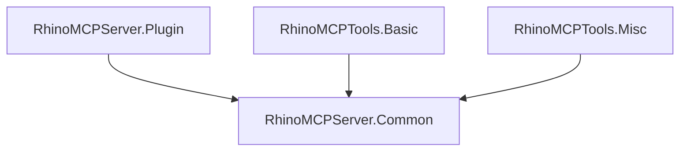

# RhinoMCPServer

A plugin for executing Model Context Protocol (MCP) server in Rhinoceros. It provides Rhino's functionality as MCP tools and enables efficient communication with MCP clients.

## Overview

This plugin exposes Rhino's functionality to MCP clients using the official [Model Context Protocol C# SDK](https://github.com/modelcontextprotocol/csharp-sdk). Instead of WebSocket communication, it adopts Server-Sent Events (SSE) to achieve more efficient and lightweight bidirectional communication.

## Project Structure

The project consists of the following libraries:

- `RhinoMCPServer.Common`: Common foundation for MCP tools (interfaces, tool management, etc.)
- `RhinoMCPServer.Plugin`: Main Rhino plugin implementation
- `RhinoMCPTools.Basic`: Basic geometry operation tools
- `RhinoMCPTools.Misc`: Utility tools

## Plugin Extensibility

MCP tools are dynamically loaded from DLLs, which means:

- New tools can be added by simply including new DLLs
- Easy addition and removal of plugins
- New tools are automatically recognized upon server restart

## Usage Example
### Drawing from Sketch & Attribute Information Assignment
https://github.com/user-attachments/assets/5eaae01c-27b7-4d4f-961f-a4c1ad64ff7f

## System Requirements

- Rhino 9 WIP
- .NET 8.0 Runtime

## How to Use

### Starting the MCP Server

1. Enter `StartMCPServerCommand` in Rhino's command line
2. Port number configuration
   - Default: 3001 (automatically used when pressing Enter)
   - Custom: Any port number can be entered
3. After server startup, it waits for MCP client connections on the specified port

### Connecting with MCP Clients

Currently, Claude Desktop's MCP client does not directly support SSE connections, so you need to use the [MCP server that bridges standard I/O to SSE](https://github.com/boilingdata/mcp-server-and-gw).

## Provided MCP Tools

- **echo**
  - Function: Echo back input text (for health check)
  - Parameters:
    - `message` (string, required) - Text to echo back

- **sphere**
  - Function: Create a sphere in Rhino
  - Parameters:
    - `radius` (number, required) - Sphere radius (in current Rhino units)
    - `x` (number, optional, default: 0) - X coordinate of sphere center
    - `y` (number, optional, default: 0) - Y coordinate of sphere center
    - `z` (number, optional, default: 0) - Z coordinate of sphere center

- **deleteObject**
  - Function: Delete a Rhino object with specified GUID
  - Parameters:
    - `guid` (string, required) - GUID of the object to delete

- **polyline**
  - Function: Create a polyline from specified points
  - Parameters:
    - `points` (array, required, minItems: 2) - Array of points defining polyline vertices
      - Parameters for each point:
        - `x` (number, required) - X coordinate
        - `y` (number, required) - Y coordinate
        - `z` (number, optional, default: 0) - Z coordinate

- **set_user_text**
  - Function: Set user text attributes for a Rhino object
  - Parameters:
    - `guid` (string, required) - GUID of the target Rhino object
    - `key` (string, required) - Key for the user text attribute
    - `value` (string, required) - Value to set

## Logs

Server logs are saved in:
- `logs/MCPRhinoServer_.log` within the plugin directory

## License

This project is released under the [MIT License](./LICENSE). Please refer to the LICENSE file for details.