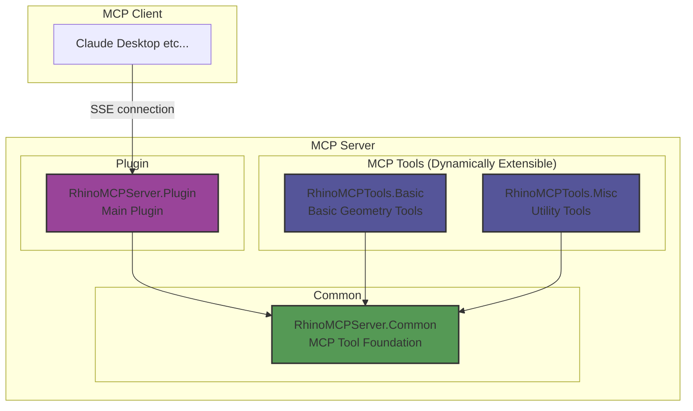

# RhinoMCPServer

A plugin for executing Model Context Protocol (MCP) server in Rhinoceros. It provides Rhino's functionality as MCP tools and enables efficient communication with MCP clients.

## Overview

This plugin exposes Rhino's functionality to MCP clients using the official [Model Context Protocol C# SDK](https://github.com/modelcontextprotocol/csharp-sdk). Instead of WebSocket communication, it adopts Server-Sent Events (SSE) to achieve more efficient and lightweight bidirectional communication.

## Project Structure

The project consists of the following libraries:

- `RhinoMCPServer.Common`: Common foundation for MCP tools (interfaces, tool management, etc.)
- `RhinoMCPServer.Plugin`: Main Rhino plugin implementation
- `RhinoMCPTools.Basic`: Basic geometry operation tools
- `RhinoMCPTools.Misc`: Utility tools

## Plugin Extensibility

MCP tools are dynamically loaded from DLLs, which means:

- New tools can be added by simply including new DLLs
- Easy addition and removal of plugins
- New tools are automatically recognized upon server restart

## Usage Example
### Drawing from Sketch & Attribute Information Assignment
https://github.com/user-attachments/assets/5eaae01c-27b7-4d4f-961f-a4c1ad64ff7f

### Tracing Existing Drawings
https://github.com/user-attachments/assets/932d62ed-335f-4238-806a-faafcfacf0b6

## System Requirements

- Rhino 9 WIP
- .NET 8.0 Runtime

## How to Use

### Starting the MCP Server

1. Enter `StartMCPServer` in Rhino's command line
2. Port number configuration
   - Default: 3001 (automatically used when pressing Enter)
   - Custom: Any port number can be entered
3. After server startup, it waits for MCP client connections on the specified port

### Connecting with MCP Clients

Currently, Claude Desktop's MCP client does not directly support SSE connections, so you need to use the [MCP server that bridges standard I/O to SSE](https://github.com/boilingdata/mcp-server-and-gw).

## Provided MCP Tools

### RhinoMCPTools.Basic
Basic geometry operation and drafting tools.

#### Drafting Tools (Drafting)

- **linear_dimension**
  - Function: Creates a linear dimension between two points
  - Parameters:
    - `start` (object, required) - Start point coordinates
      - `x` (number, required) - X coordinate
      - `y` (number, required) - Y coordinate
      - `z` (number, optional, default: 0) - Z coordinate
    - `end` (object, required) - End point coordinates
      - `x` (number, required) - X coordinate
      - `y` (number, required) - Y coordinate
      - `z` (number, optional, default: 0) - Z coordinate
    - `offset` (number, optional, default: 1.0) - Offset distance for dimension line
    - `scale` (number, optional, default: 1.0) - Dimension scale value (must be greater than 0)

- **set_dimension_scale**
  - Function: Sets the dimension scale of dimension objects
  - Parameters:
    - `guids` (array of string, required) - Array of GUIDs of the dimension objects to modify
    - `scale` (number, required) - The new dimension scale value (must be greater than 0)

#### Geometry Tools (Geometry)

- **sphere**
  - Function: Create a sphere in Rhino
  - Parameters:
    - `radius` (number, required) - Sphere radius (in current Rhino units)
    - `x` (number, optional, default: 0) - X coordinate of sphere center
    - `y` (number, optional, default: 0) - Y coordinate of sphere center
    - `z` (number, optional, default: 0) - Z coordinate of sphere center

- **rectangle**
  - Function: Create a rectangle from center point, width (x-direction), and height (y-direction)
  - Parameters:
    - `center` (object, required) - Center point of the rectangle
      - `x` (number, required) - X coordinate
      - `y` (number, required) - Y coordinate
      - `z` (number, optional, default: 0) - Z coordinate
    - `width` (number, required) - Width of the rectangle (x-direction, must be greater than 0)
    - `height` (number, required) - Height of the rectangle (y-direction, must be greater than 0)

- **polyline**
  - Function: Create a polyline from specified points
  - Parameters:
    - `points` (array, required) - Array of points defining polyline vertices (minimum 2 points required)
      - Parameters for each point:
        - `x` (number, required) - X coordinate
        - `y` (number, required) - Y coordinate
        - `z` (number, optional, default: 0) - Z coordinate

- **move_objects**
  - Function: Move specified Rhino objects along a vector
  - Parameters:
    - `guids` (array of string, required) - Array of GUIDs of the objects to move
    - `vector` (object, required) - Movement vector
      - `x` (number, required) - X component of movement distance
      - `y` (number, required) - Y component of movement distance
      - `z` (number, optional, default: 0) - Z component of movement distance

#### Object Tools (Object)

- **delete_object**
  - Function: Delete a Rhino object with specified GUID
  - Parameters:
    - `guid` (string, required) - GUID of the object to delete

- **delete_objects**
  - Function: Deletes multiple Rhino objects by their GUIDs
  - Parameters:
    - `guids` (array of string, required) - Array of GUIDs of the objects to delete

- **set_text_dot_size**
  - Function: Sets the font height of text dots
  - Parameters:
    - `guids` (array of string, required) - Array of GUIDs of the text dots to modify
    - `font_height` (number, required) - New font height (minimum value: 1)

- **set_user_text**
  - Function: Set user text attributes for a Rhino object
  - Parameters:
    - `guid` (string, required) - GUID of the target Rhino object
    - `key` (string, required) - Key for the user text attribute
    - `value` (string, required) - Value to set

#### View Tools (View)

- **capture_viewport**
  - Function: Captures the specified Rhino viewport as an image
  - Parameters:
    - `viewportName` (string, optional) - The name of the viewport to capture (uses active viewport if not specified)
    - `width` (number, optional) - The width of the captured image in pixels (uses current viewport width if not specified)
    - `height` (number, optional) - The height of the captured image in pixels (uses current viewport height if not specified)
    - `format` (string, optional, enum: ["png", "jpg"], default: "png") - The image format to use
    - `show_object_labels` (boolean, optional, default: true) - Whether to display simple symbol labels (A, B, C..., AA, AB...) for objects in the viewport
    - `font_height` (number, optional, default: 20.0) - Font size for the labels

### RhinoMCPTools.Misc
Utility tools.

- **echo**
  - Function: Echo back input text (for health check)
  - Parameters:
    - `message` (string, required) - Text to echo back

## Logs

Server logs are saved in:
- `logs/MCPRhinoServer_.log` within the plugin directory

## License

This project is released under the [MIT License](./LICENSE). Please refer to the LICENSE file for details.